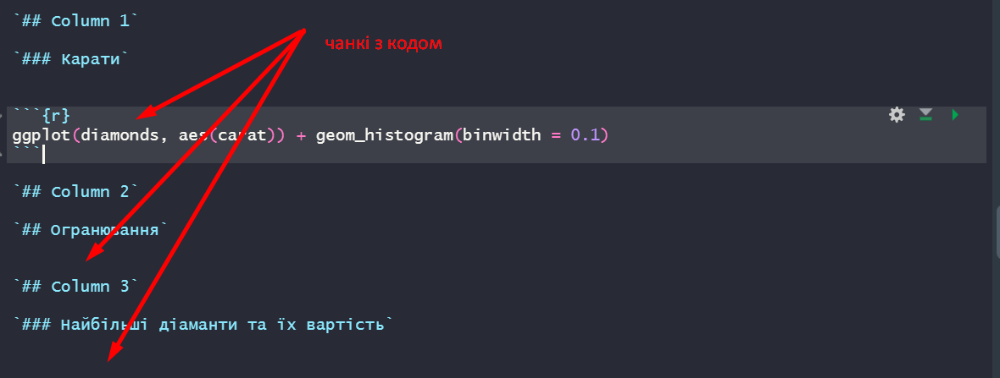
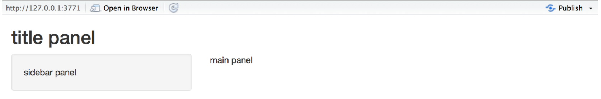
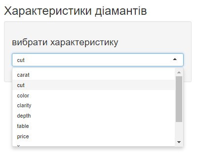
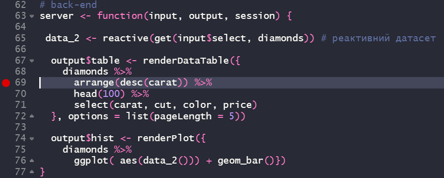
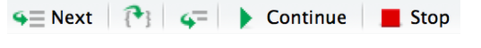
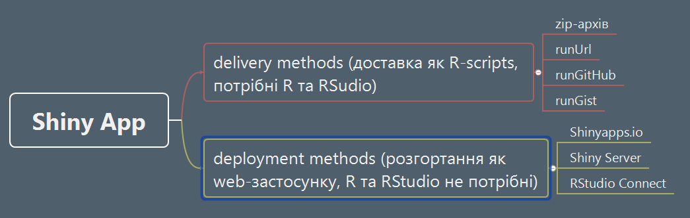

# Лабораторна робота №4. Доставка результатів Data Science-проєкту та його розгортання

__Мета:__ Ознайомлення з інструментарієм доставки та розгортання аналітичних рішень Data Science-проекту за допомогою RMarkdown-дашбордів та фреймворка Shiny. 


## Що ви будете вміти?

* Створювати дашборди для подання (доставки) результатів аналізу.
* Використовувати фреймворк Shiny та засоби мови R у середовищі IDE RStudio для розробки front- та back-and частини аналітичного Web-застосунку (Shiny App) з реактивним інтерфейсом.
* Розгортати Shiny App, зокрема у хмарному сховищі Shinyapps.io.


## Короткі теоретичні відомості

Остання фаза будь-якого Data Science-проєкту згідно з методологією [CRISP DM](https://www.the-modeling-agency.com/crisp-dm.pdf) [@CRISP_DM] -- **розгортання** (deployment), яка передбачає **в широкому сенсі** розробку певного інтерфейсу у певному середовищі кінцевому замовнику для доступу до аналітичного застосунку з можливістю подальшого використання запропонованого аналітичного рішення. Такого роду задача входить до компетенцій фахівця на позиції *Data Scientist*.  

У **вузькому сенсі** можна говорити не про фазу *deployment*, а про фазу *communicate* [@r4ds] (рис. 4.1). Так як замовник (або інші члени команди) часто ставлять задачу не розгортання аналітичного рішення у вигляді програмного застосунку з високорівневим інтерфейсом, а лише доставки (delivery), тобто, подання проміжних чи остаточних  результатів, можливо, з елементами інтерактивності. Такого роду задача входить до компетенцій фахівця на позиції *Data Analyst*.    

 

 
Мова і середовище програмування R та IDE RStudio також має в своєму арсеналі достатньо інструментів для вирішення такого роду задач.

Серед засобів подання результатів аналітики може виступати формат ноутбуків на основі RMarkdown, яким ми користувалися до цього моменту. Нижче буде показано модифікацію електронного RMarkdown-документу, який дозволяє створювати даш-борди.  

В якості інструменту розгортання буде розглянуто найбільш популярний фреймворк Shiny.


## Створення дашборду {#dash}

[**Інформаційна панель**](https://uk.wikipedia.org/wiki/%D0%86%D0%BD%D1%84%D0%BE%D1%80%D0%BC%D0%B0%D1%86%D1%96%D0%B9%D0%BD%D0%B0_%D0%BF%D0%B0%D0%BD%D0%B5%D0%BB%D1%8C) (інфопанель, дашборд) -- тип графічного інтерфейсу користувача, що забезпечує наочну презентацію основних показників продуктивності (ОПП), значимих для конкретної цілі чи підприємчого процесу. Інфопанелі є динамічними звітами в режимі реального часу, за допомогою яких керівники та менеджери слідкують за визначеними показниками.  

Інформаційні панелі можуть містити графіки, таблиці, картки показників та примітки щодо ефективності підприємчого процесу. 

Тобто, в основі дашбордів лежить та ж сама технологія грамотного програмування, яка дозволяє створювати їх на льоту.  

Приклад коду найпростішого дашборду можна подивитися [тут](https://r4ds.had.co.nz/r-markdown-formats.html#r-markdown-formats) [@r4ds].  

Для генерації дашборду необхідно виконати наступні дії:

1. Налаштувати шапку YAML-хедера наступним чином:

`---`  
`title: "Diamonds distribution dashboard"`  
`output: flexdashboard::flex_dashboard`  
`---`  

2. Задати кожну колонку у вигляді 

`## Column 1`

`## Column 2`

`## Column 3`

3. Як підпункти виділити назви зон виводу візуалізаторів у відповідну колонку:

`## Column 1`

`### Карати`


`## Column 2`

`### Огранювання`


`## Column 3`

`### Найбільші діаманти та їх вартість`


4. У відповідну зону написати код, який генерує потрібний візуалізатор:



Після компіляції дашбоард буде мати [наступний вигляд](https://prnt.sc/ddCVGxrH183B).


## Фреймворк Shiny {#Shiny}


Згідно з електронним керівництвом [Learn Shiny](https://shiny.rstudio.com/tutorial/).

`Shiny` [@R-shiny] — це пакет R, який дозволяє легко створювати інтерактивні веб-застосунки прямо з R, розроблений на базі Twitter Bootstrap. 

Нижче розглянемо його структуру та наведемо основні елементи, які пояснюють концепцію цього фреймворка та дозволяють створити простий web-застосунок.

### Структура Shiny App застосунку

Shiny App-застосунок міститься в одному скрипті під назвою *app.R*. Сценарій *app.R* знаходиться в каталозі (наприклад, dirname/), і програму можна запускати за допомогою runApp("dirname").

*app.R* складається з трьох компонент:

* інтерфейсна частина (front-and)

* серверна частина (back-and)

* виклик функції shinyApp

Інтерфейсна частина (`ui`) контролює макет і зовнішній вигляд програмного застосунку. Серверна частина містить інструкції, необхідні комп’ютеру для створення програми. Нарешті функція `shinyApp` створює об’єкти програми `Shiny` з наявної пари *інтерфейс користувача/сервер*.

Застосунок, який виводить рядок *Hello, World!* виглядає наступним чином:

```{r}
# інсталюємо пакет
suppressMessages(library(shiny))
# front-end
ui <- fluidPage(
  "Hello, world!"
)

# back-end
server <- function(input, output, session) {
}

# заупуск застосунку
# shinyApp(ui, server)
```

Кожен Shiny застосунок має однакову структуру: файл *app.R*, який містить інтерфейс користувача та сервер. Ми можемо створити Shiny застосунок, створивши новий каталог і зберігши в ньому файл *app.R*. Рекомендується кожний застосунок розміщувати в окремому унікальному каталозі.

Для запуску Shiny застосунку необхідно скористатися функцією `runApp`, передавши їй в якості параметра ім'я каталогу, в якому містисться застосунок.  Наприклад, якщо Shiny застосунок знаходиться в каталозі під назвою `my_app`, то для її запуску необхідно виконати наступне:

```{r}
library(shiny)
# runApp("my_app")
```

Для запуску коду з середовища `R Studio` необхідно натиснути комбінацію клавіш *Ctrl-Shif-Enter* і за замовчанням застосунок запускається в режимі *Run in Window*.


### Структура front-end частини

`Shiny` використовує функцію `fluidPage()` для створення дисплея, який автоматично підлаштовується під розміри вікна браузера вашого користувача. Таким чином ми створюємо інтерфейс користувача своєї програми, розміщуючи елементи у функції `fluidPage()`.

Наприклад, функція інтерфейсу користувача, наведена нижче, створює інтерфейс користувача, який має панель заголовків `titlePanel()` і макет бічної панелі `titlePanel()`, що включає бічну панель `sidebarPanel()` та головну панель `mainPanel()`. Слід звернути увагу на те, що ці елементи розміщуються в середині функції `fluidPage()`. У той же час, ці елементи є необов'язковими. 

```{r}
ui <- fluidPage(
  titlePanel("title panel"),

  sidebarLayout(
    sidebarPanel("sidebar panel"),
    mainPanel("main panel")
  )
)
```



`titlePanel()` і `sidebarLayout()` — два найпопулярніші елементи, які можна додати до `fluidPage`. Вони створюють базову програму `Shiny` з боковою панеллю.

`sidebarLayout` завжди приймає два аргументи:

* функцію вводу `sidebarPanel`

* функцію виводу `mainPanel`

Ці функції розміщують вміст або на бічній панелі, або на основних панелях.


Для взаємодії користувача з застосунком до інтерефейсної частини необхідно додати необхідні [віджети](https://shiny.rstudio.com/tutorial/written-tutorial/lesson3/). Віджет -- це веб-елемент, який надає можливість надсилати повідомлення до  Shiny застосунку і забезпечує, таким чином, його інтерактивність. Віджети у Shiny представляються сімейством функцій `*Input`.

Внесемо до нашої інтерфейсної частини елемент "випадаючий список" (див. приклад з [дашбордом](#dash)), скориставшись функцією `selectInput` і стандартним датасетом `diamonds`, який входить до пакету `ggplot2`.

```{r}
# інсталюємо пакет
library(shiny)
library(ggplot2)

# front-end
ui <- fluidPage(
  titlePanel("Характеристики діамантів"),
  sidebarLayout(
    sidebarPanel(  
       selectInput("select", h3("вибрати характеристику"), 
                               choices = names(diamonds), 
                  selected = 1),
    ),
    mainPanel()
  )
)

```



Більш детально про віджети можна прочитати [тут](https://shiny.rstudio.com/tutorial/written-tutorial/lesson4/), [тут](https://shiny.rstudio.com/articles/layout-guide.html) і у [@wickham2021mastering].

Найголовніша осбливість будь-якого Shiny застосунку, це можливість створення реактивного виходу. Для цього необхідно виконати два наступні кроки:

* Додати об’єкт R до свого інтерфейсу користувача.

* Дати вказівку Shiny, як побудувати об’єкт у функції сервера. Об’єкт буде реактивним, якщо код, який його створює, викликає значення віджета.

Shiny надає [сімейство функцій](https://shiny.rstudio.com/tutorial/written-tutorial/lesson4/), які перетворюють об'єкти R у вихідні дані для вашого інтерфейсу користувача. Кожна функція створює певний тип виводу.  

Для того, щоби в нашому прикладі вивести необхідну гістограму, нам потрібно скористатися функцією `plotOutput`, а для виводу таблиці -- функцією `tableOutput` ввівши їх у панель виводу `mainPanel`,

```{r}
# front-end
ui <- fluidPage(
  titlePanel("Характеристики діамантів"),
  sidebarLayout(
    sidebarPanel(  
      selectInput("select", h3("вибрати характеристику"), 
                               choices = names(diamonds), 
                  selected = 1),
      
    ),
    mainPanel(
      plotOutput("hist"),
      dataTableOutput("table")
    )
  )
)

```

Реалізація другого етапу потребує написання серверної частини, з відповідним функціоналом, тобто, back-end. 


### Структура back-end частини

Розміщення функції в інтерфейсній частині `ui` користувача вказує `Shiny`, де відображати наш об’єкт. Далі нам потрібно вказати `Shiny`, як побудувати об’єкт. Для цього ми пишемо відповідний код у серверній частині застосунку.

Функція `server` створює об’єкт, подібний до списку, з назвою виведення, який містить весь код, необхідний для оновлення об’єктів R у вашій програмі. Кожен об’єкт R повинен мати власний запис у списку.

Ми маємо створити запис, визначивши новий елемент для виведення `output` всередині `server`, як показано нижче. Ім’я елемента має відповідати імені реактивного елемента, який було створено в інтерфейсній частині `ui`.  

```{r}
# back-end
server <- function(input, output, session) {
  
  data_1 <- diamonds %>% # звичайний датасет
    arrange(desc(carat)) %>%
    head(100) %>%
    select(carat, cut, color, price)

  data_2 <- reactive(get(input$select, diamonds)) # реактивний датасет
    
  output$table <- renderDataTable(data_1, options = list(pageLength = 5))
  output$hist <- renderPlot(ggplot(diamonds, aes(data_2())) + geom_bar())
}

```

Кожен елемент виведення `output` -- це виклик однієї з функцій сімейства рендерингу render\*.  Слід використовувати функцію render*, відповідно  до типу реактивного об’єкта, який ми створюємо. Див. детально [тут](https://shiny.rstudio.com/tutorial/written-tutorial/lesson4/). 

У нашому випадку ми використовуємо `renderDataTable()` для виводу інтерактивної таблиці і `renderPlot()` для виводу гістограми.  

Особливо слід відмітити, що для забезпечення реактивної зміни гістограми при виборі відповідного датасету, необхідно використовувати функцію `reactive()`. Водночас для рендерінгу таблиці така необхідність не виникає. Це дає нам можливість оптимізувати код серверної частини за допомогою потокового оператора, виключивши зайву змінну `data_1`. 


```{r}
server <- function(input, output, session) {
  
 data_2 <- reactive(get(input$select, diamonds)) # реактивний датасет
  
  output$table <- renderDataTable({
    diamonds %>% 
      arrange(desc(carat)) %>%
      head(100) %>%
      select(carat, cut, color, price)
  }, options = list(pageLength = 5))
  
  output$hist <- renderPlot({
    diamonds %>% 
      ggplot( aes(data_2())) + geom_bar()})
}
```

У результаті інтерфес нашого застосунок буде виглядати [наступним чином](https://prnt.sc/Ntn5xh8Yq9SO).


### Відлагодження web-застосунку

Для відлагодження коду у `Shiny` існує потужній інструмент -- **інтерактивний налагоджувач (interactive debugger)** [@wickham2021mastering]. Налагоджувач призупиняє виконання та надає вам інтерактивну консоль R, де ми можемо запустити будь-який код, щоб з’ясувати, що пішло не так. Існує два способи запуску налагоджувача:

* Для цього необхідно додати виклик функції `browser()` у своєму вихідному коді. Це стандартний спосіб R для запуску інтерактивного налагоджувача, який працюватиме незалежно від того, як ми запускаємо Shiny.

Інша перевага `browser()` полягає в тому, що, оскільки це код R, ми можемо об’єднати його з оператором `if`. Це дозволяє запускати налагоджувач лише для проблемних вводів.


```{r}
# if (input$select == "carat") {
#   browser()
# }
```

* Додати точку зупинки RStudio, клацнувши ліворуч від номера рядка. Ми можемо видалити точку зупину, натиснувши на червоне коло.


Перевага точок зупинки полягає в тому, що вони не є кодом, тому нам ніколи не доведеться турбуватися про випадкову перевірку їх у нашій системі контролю версій.

Якщо ми використовуємо RStudio, панель інструментів (лив. рис. ) на з’явиться у верхній частині консолі, коли ви перебуваєте в налагоджувачі.  





Панель інструментів — це простий спосіб запам’ятати команди налагодження, які тепер нам доступні. Вони також доступні за межами RStudio; нам просто потрібно запам’ятати команду з однієї букви, щоб активувати їх. Три найкорисніші команди:

* `Next` (натисніть `n`): виконує наступний крок у функції. Зауважте, що якщо у нас є змінна з іменем `n`, нам потрібно буде використовувати `print(n)`, щоб відобразити її значення.

* `Continue` (натисніть `c`): продовжує регулярне виконання функції. Це корисно, якщо ми виправили помилку  і хочемо перевірити, чи функція працює правильно.

* `Stop` (натиснути `Q`): зупиняє режим налагодження, припиняє роботу функції та повертається до глобального робочого простору. Це потрібно використовувати, коли ми зрозуміємо, де проблема, і будемо готові виправити її та перезавантажити код.


### Доставка та розгортання web-застосунку


Існує декілька способів доставки/розгортання Shiny застосунку. 



Для того, щоби будь-хто міг запустити наш Shiny застосунок необхідно надати йому копію файлу `app.R`, а також будь-які додаткові матеріали, які використовуються у цій програмі (наприклад, папки `www` або файли `helpers.R`).

Щоб надіслати файли іншому користувачеві, необхідно надіслати файли електронною поштою (можливо, у zip-файлі) або розмістити файли в Інтернеті (`runUrl`, `runGitHub`, `runGist`).  

Користувач може розмістити файли в каталозі програми у своєму робочому каталозі. Застосунок може бути запущено в R за допомогою тих самих команд, які було [розглянуто вище](#Shiny).  

```{r}
library(shiny)
# runApp("my_app")
```

Для розгортання проекту у вигляді web-застосунку існує три способи:

* [Shinyapps.io](https://www.shinyapps.io/?_ga=2.68346006.606918479.1647117734-136314609.1527258720) -- хмарний сервіс від RStudio, дозволяє завантажувати додаток прямо з сеансу R на сервер, розміщений на RStudio. У цьому випадку  ми маємо повний контроль над своєю програмою, включаючи інструменти адміністрування сервера.

* [Shiny Server](https://github.com/rstudio/shiny-server/blob/master/README.md) -- це програма-супутник для Shiny, яка створює веб-сервер, призначений для розгортання Shiny застосунків, є безкоштовною, з відкритим вихідним кодом і доступною на GitHub. Дає можливість розміщувати кілька  Shiny застосунків на кількох веб-сторінках за допомогою одного Shiny Server, а також здійснювати розгортання через брандмауер.

* [RStudio Connect](https://www.rstudio.com/products/connect/?_ga=2.16385201.606918479.1647117734-136314609.1527258720) -- видавнича платформа для роботи, яку команди розробників створюють у R. Дозволяє також поширювати звіти R Markdown, інформаційні панелі, графіки, блокноти Jupyter та багато іншого в одному зручному місці. За допомогою RStudio Connect можна публікувати звіти з RStudio IDE одним натисканням кнопки та планувати виконання звітів з  гнучкою політикою безпеки.


Створений нами  застосунок і розгорнутий у хмарі `shinyapps.io` знаходиться [тут](https://hamalii.shinyapps.io/my_app/). 


### Індивідуальні завдання на лабораторну роботу

Видає викладач.


