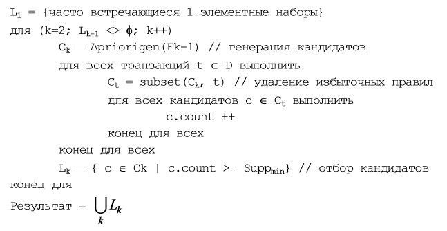

# Лабораторна робота №7. Пошук асоціативних правил


__Мета:__ Засвоєння базових принципів, знайомство з інструментами та набуття навичок __побудови моделей на основі асоціативних правил на рівні технології__ засобами мови програмування R та за допомогою пакетів `arules` [@R-arules] та `arulesViz` [@R-arulesViz].


## Що ви будете вміти?

* будувати моделі пошуку асоціативних правил засобами мови R і пакету `arules` у середовищі IDE RStudio.
* виконувати візуалізацію асоціативних правил та їх параметрів засобами пакета `arulesViz`.

## Короткі теоретичні відомості

У рамках життєвого циклу процесу Data Mining згідно з методологією CRISP DM [@CRISP_DM], наступною за  фазою "Підготовка даних" (__Data Preparing__) є фаза "Моделювання" (__Modelling__) (рис. 1).     
Фаза моделювання призначена для вибору оптимального методу побудови моделей і настроювання його параметрів для отримання оптимальних рішень. На даній фазі вирішуються наступні задачі:

* вибір методу моделювання;  
* генерація тестового проекту;  
* __створення моделей;__  
* оцінка моделей.   

Згідно з класичним розумінням технологія Data Mining передбачає побудову моделей, які можна віднести до одного з п'яти основних класів: _кластеризація (сегментація) та аналіз відхилень, регресія, класифікація, пошук асоціативних правил та аналіз послідовних шаблонів(секвенціальний аналіз)_.  

  


Задача сегментації та аналізу відхилень розглядалася нами як складова розвідувального аналізу даних [__лаб. роб. №3__](#lab_3) у рамках базового модулю.  
У рамках даного модулю буде розглянуто решту моделей. 

Задачі моделей регресії та класифікації розглядались у [__лаб. роб. №5__](#lab_5) та [__лаб. роб.  №6__](#lab_6) відповідно.

Ця лабораторна робота присвячена побудові моделей на основі асоціативних правил.


### У чому полягає задача пошуку асоціативних правил?

Пошук асоціативних правил є одним з найпопулярніших застосувань Data Mining. Суть задачі полягає у визначенні наборів об'єктів, що часто зустрічаються у  великий колекціях таких наборів. Дане завдання є окремим випадком задачі класифікації. Спочатку вона вирішувалася при аналізі тенденцій у поведінці покупців у супермаркетах. Аналізу піддавалися дані про здійснені ними покупки, які покупці складають до кошика.

При аналізі цих даних інтерес перш за все викликає інформація про те, які товари купуються разом, в якій послідовності, які категорії споживачів які товари купують краще, в які періоди часу і т. п. Така інформація дозволяє  ефективніше планувати закупівлю товарів, проведення рекламної кампанії і т. д. Наприклад, з набору покупок, що здійснюються в магазині, можна виділити наступні набори товарів, які купуються разом: $\{чіпси, пиво\}; \{вода, горіхи\}$. Отже, можна зробити висновок, що якщо купуються чіпси або горіхи, то, як правило, купуються і пиво або вода відповідно. Маючи такі знання, можна розмістити ці товари поруч, об'єднати їх в один пакет зі знижкою або вжити інших заходів, що стимулюють покупця придбати товар.  

Задача пошуку асоціативних правил є актуальною не тільки в сфері торгівлі. Наприклад, у сфері обслуговування інтерес представляє інформація про те, якими послугами клієнти бажають користуватися в сукупності. Для отримання цієї інформації завдання вирішується стосовно до даних про послуги, якими користується один клієнт протягом певного часу (місяці, роки). Це допомагає визначити, наприклад, як найбільш вигідно скласти пакети послуг, що можуть бути запропоновані клієнту.  

У медицині аналізу можуть піддаватися симптоми і хвороби, які спостерігаються у пацієнтів. У цьому випадку знання про те, які поєднання хвороб і симптомів зустрічаються найбільш часто, допомагають в майбутньому правильно ставити діагноз [@Barsegjan].

### Формальна постановка задачі класифікації

Опишемо цю задачу в узагальненому вигляді [@Barsegjan]. Для цього позначимо об'єкти, що становлять досліджувані набори (itemsets), наступною множиною:  

$$I = \{ i_1, i_2,..., i_j,...,i_n \},$$
де $i_j$ -- об'єкти, що входять до наборів, котрі підлягають аналізу; $n$ -- загальна кількість об'єктів. У сфері торгівлі, наприклад, такими об'єктами є товари, представлені в прайс-листі.  

```{r echo=FALSE}
df <- data.frame(`Ідентифікатор` = c(0:5),
                 `Найменування товару` = c("Шоколад", "Чіпси", "Кокоси", "Вода", "Пиво", "Горіхи"),
                 `Ціни` = c(30.00, 12.00, 10.00, 4.00, 14.00, 15.00)
                 )
knitr::kable(df, caption = "Прайс-лист")
```

Вони відповідають наступній множині об'єктів:

$$I = \{шоколад, чіпси, кокоси, вода, пиво, горіхи \}.$$
Набори об'єктів з множині $I$, що зберігаються в БД і піддаються аналізу, називаються _транзакціями_. Опишемо транзакцію як підмножину множини $I$:

$$T = \{i_j | i_j \in I \}. $$

Такі транзакції в магазині відповідають наборам товарів, що купуються споживачем і зберігаються в БД у вигляді товарного чека або накладної. У них перераховуються придбані покупцем товари, їх ціна, кількість тощо. Наприклад, такі транзакції відповідають покупкам, що здійснюються споживачами в супермаркеті:

$$
T_1 = \{ чіпси, вода, пиво \}; \\ 
T_2 = \{кокоси, вода, горіхи \}.
$$

Набір транзакцій, інформація про які доступна для аналізу, позначимо наступною множиною:

$$D = \{ T_1, ..., T_2,..., T_r,..., T_m \},$$
де $m$ -- кількість доступних для аналізу транзакцій.

Наприклад, у магазині такою множиною буде:

$$D = \{ \{чіпси, вода, пиво \}, \{кокоси, вода, горіхи \}, \\ \{горіхи, кокоси, чіпси, кокоси, вода \}, \\
\{кокоси, горіхи, кокоси \} \}.$$

Для використання методів Data Mining множину D може бути представлено у вигляді табл. 2.  


```{r echo=FALSE}
df <- data.frame(`Номер транзакції` = c(0, 0, 0, 1, 1, 1, 2, 2, 2, 2, 2, 3, 3, 3),
                 `Номер товара` = c(1, 3, 4, 2, 3, 5, 5, 2, 1, 2, 3, 2, 5, 2),
                 `Найменування товару` =  c("Чіпси", "Вода", "Пиво", "Кокоси", "Вода", "Горіхи", "Горіхи", "Кокоси", "Чіпси", "Кокоси", "Вода", "Кокоси", "Горіхи", "Кокоси"),
                 `Ціни` = c(12.00, 4.00, 14.00, 10.00, 4.00, 15.00, 15.00, 10.00, 12.00, 10.00, 4.00, 10.00, 15.00, 10.00)
                 )
knitr::kable(df, caption = "Прайс-лист")
```

Множину транзакцій, до яких входить об'єкт $j_i$, позначимо в такий спосіб:

$$D_{i_j} = \{ T_r | i_j \in T_r; j = 1..n; r = 1..m \} \subseteq D.$$

У даному прикладі множиною транзакцій, що містять об'єкт `вода`, є наступна множина:

$$Dвода = \{ \{чіпси, вода, пиво\},\\ \{кокоси, вода, горіхи \}, \\ \{ горіхи, кокоси, чіпси, кокоси, вода \}\}.$$
Деякий довільний набір об'єктів (itemset) позначимо в такий спосіб: 
$$F = \{ i_j | i_j \in I; j = 1..n \}.$$

Наприклад, $$F = \{ кокоси, вода \}.$$
Набір, що складається з $k$ об'єктів, називається $k$-елементним набором (в даному прикладі це 2-елементний набір).  
Множина транзакцій, в які входить набір $F$, позначимо в такий спосіб:

$$D_F = \{ T_r | F \subseteq T_r; r = 1..m \} \subseteq D.$$

У даному прикладі:

$$D \{ кокоси, вода \} = \{ \{кокоси, вода, горіхи \}, \{ горіхи, кокоси, чіпси, кокоси, вода \} \}.$$
Відношення кількості транзакцій, до якого входить набір $F$, до загальної кількості транзакцій називається _підтримкою (support)_ набору $F$ і позначається $S(F)$:
$$S(F) = \frac{|D_F|}{D}.$$

Для набору $\{кокоси, вода\}$ підтримка буде дорівнює $0,5$, так як даний набір входить до двох транзакцій (з номерами $1$ і $2$), а всього транзакцій $4$. При пошуку аналітик може вказати мінімальне значення підтримки цікавих йому наборів $S_{min}$. Набір називається частим (large itemset), якщо значення його підтримки більше мінімального значення підтримки, заданого користувачем:

$$S(F) > S_{min}.$$

Таким чином, при пошуку асоціативних правил потрібно знайти множину всіх частих наборів:

$$L = \{ F | S(F) > S_{min} \}.$$
У даному прикладі частими наборами при $S_{min} = 0,5$ є наступні:  

$$\{Чіпси\} \; S_{min} = 0,5; \\
\{Чіпси, вода \} \; S_{min} = 0,5; \\
\{Кокоси\} \; S_{min} = 0,75; \\
\{Кокоси, вода\} \; S_{min} = 0,5;\\
\{Кокоси, вода, горіхи\} \; S_{min} = 0,5; \\
\{Кокоси, горіхи\} \; S_{min} = 0,75;\\
\{Вода\} \; S_{min} = 0,75; \\
\{Вода, горіхи\} \; S_{min} = 0,5; \\
\{Горіхи\} \; S_{min} = 0,75.$$

Результати, одержані при розв'язку цього завдання, прийнято представляти у вигляді _асоціативних правил_. У зв'язку з цим при їх пошуку виділяють два основних етапи:

* знаходження всіх частих наборів об'єктів;
* генерація асоціативних правил із знайдених частих наборів об'єктів.

Асоціативні правила мають такий вигляд:
`якщо (умова) то (результат)`  

де `умова` -- зазвичай не логічний вираз (як у класифікаційних правилах), а набір об'єктів з множини $I$, з якими пов'язані (асоційовані) об'єкти, включені до результату даного правила. Наприклад, асоціативне правило:
$$якщо \; (кокоси, вода) \; то \; (горіхи)$$
означає, що якщо споживач купує кокоси і воду, то він купує і горіхи. Як уже зазначалося, в асоціативних правилах умова і результат є об'єктами множини $I$:

$$якщо \; X \; то \; Y,$$
де $X \in I, Y \in I, X \cup Y = \phi.$  
Асоціативне правило можна представити як імплікацію (зв'язок) над множиною $X \Rightarrow Y$, де $X \in I, Y \in I, X \cup Y = \phi.$ 


### Основні міри "цікавості" асоціативних правил

Основною перевагою асоціативних правил є їх легке сприйняття людиною і проста інтерпретація мовами програмування. Однак вони не завжди корисні. Виділяють три види правил:

* _корисні правила_ -- містять дійсну інформацію, яка раніше була невідома, але має логічне пояснення. Такі правила можуть бути використані для прийняття рішень, що приносять вигоду;

* _тривіальні правила_ -- містять дійсну та легко зрозумілу інформацію, яка вже відома. Такі правила, хоча і можна пояснити, але не можуть принести будь-якої користі, так як відображають або відомі закони в досліджуваній області, або результати минулої діяльності. Іноді такі правила можуть використовуватися для перевірки виконання рішень, прийнятих на підставі попереднього аналізу;

* _незрозумілі правила_ -- містять інформацію, яка не може бути пояснена. Такі правила можуть бути отримані або на основі аномальних значень, або глибоко прихованих знань. Безпосередньо такі правила не можна використовувати для прийняття рішень, так як їх нез'ясовність може привести до непередбачуваних результатів. Для кращого розуміння потрібен додатковий аналіз. Однак саме такі правила дають можливість знайти корисні для бізнесу нетривіальни правила, які, власне, і є сенсом Data Mining.  

Кількість асоціативних правил може бути дуже великим і не всі з них несуть корисну інформацію. Тому на практиці відбирають найбільш корисні з них. Для оцінки їх корисності використовують певні міри. Наведемо основні з них.

Аосціативні правила представляють по суті кореляцію між наборами. Для оцінки ступеня цієї кореляції, яка виражає їх "цікавість" або "корисність" викорстовують головним чином наступні [@arulesViz, @arulsPackageVignet].

* _Підтримка (__support__)_ -- ймовірність події $X \cap Y$;  показує, який відсоток транзакцій підтримує дане правило і дорівнює підтримці набору $F$, які складають $X$ та $Y$:  

$$ S(X \Rightarrow Y) = P(X \cap Y) = S_F =  \frac{|D_{F=X \cup Y}|}{|D|}. $$
_Приклад_. $$S_{якщо \; (вода, \; кокоси) \; то \; (горіхи)} = S_{(вода, \; кокоси, \; горіхи)} = \frac{2}{4}.$$

* _Достовірність (__confidence__)_ -- умовна ймовірність події $Y$ за умови, що мала місце подія $X$; тобто показує ймовіврність того, що з наявності в транзакції набору $X$ слідує наявність в ній набору $Y$. Оцінюється як відношення кількості транзакцій, які містять набори $X$ та $Y$, до кількості транзакцій, що містять набор $X$:

$$ C(X \Rightarrow Y) = P(Y|X) = \frac{P(X \cap Y)}{P(X)} = \frac{|D_{F=X \cup Y}|}{|D_X|} = \frac{S_{X \cup Y}}{S_Y}. $$
_Приклад_. $$С_{якщо \; (вода, \;  то \; (горіхи)} = \frac{2}{3}.$$

Чим більше достовірність, тим правило краще. Однак достовірність де дозволяє оцінити корисність правила. Для цього викоритовуєься _ліфт_.  

* _Ліфт (__lift__)_ -- відношення умовної ймовірності $Y|X$ до безумовної $Y$, тобто він показує, чи є кориснішим правило випадкового угадування:

$$ L(X \Rightarrow Y) = \frac{P(Y|X)}{P(Y)} = \frac{P(X \cap Y)}{P(X)P(Y)} = \frac{|D_{F=X \cup Y}|}{|D_X| |D_Y|} = \frac{S_{X \cup Y}}{S_Y S_X}. $$

Очевидно, що ліфт більше за одиницю, то правило є корисним, тобто за допомогою правила передбачити наявність набору $Y$, ніж випадкове угадування.  
_Приклад_. $$L_{якщо \; (вода, \;  то \; (горіхи)} = \frac{0,5}{0,5 \cdot 0,5} = 2.$$


Одним з найпоширеніших алгоритмів пошуку асоціативних правил є алгоритм `Apriori`, описаний Срикантом Рамакришнаном і Ракешом Агравалом у 1994 р.  
Нижче наведно псевдокод згідно з [@Barsegjan].  



( Також, детально можна подивится [тут](https://habr.com/ru/company/ods/blog/353502/))

 


### Пакети `arules` та `arulesViz`

(under construction)


## Приклад виконання індивідуального завдання {#ind}


__Задача__. Використовуючи стандартний набір даних `titanic`:


```{r}
# Завантажуємо стандартний набір і трансформуємо його необхідним чином
df <- as.data.frame(Titanic)
head(df)
```


```{r}
titanic.raw <- NULL 
for(i in 1:4) {
  titanic.raw <- cbind(titanic.raw,
                       rep(as.character(df[,i]), # ????????? ??? ??????
                           df$Freq))             # ??????? ???
  }
titanic.raw <- as.data.frame(titanic.raw)
names(titanic.raw) <- names(df)[1:4]
dim(titanic.raw)
head(titanic.raw)
```

Далі скористаємося методом `apriori()` з бібліотеки `arules`. За замовчанням маємо такі зачення параметрів функції:  

minimum support: supp=0.1  
minimum confidence: conf=0.8  
maximum length of rules: maxlen=10  

Встановлюємо необхідні бібліотеки і за допомогою методу `apriori` знаходимо асоціативні правила і значення оцінок підтримки, достовірності та діфта для кожного правила.

```{r}
library(arules)
library(arulesViz)
library(magrittr)
rules.all <- titanic.raw %>% 
  apriori() ## run the APRIORI algorithm 

rules.all %>%
  length() ## number of rules discovered ## [1] 27
rules.all %>%
  # as.data.frame() %>% 
  inspect() %>% ## print all rules
  knitr::kable() 
```

Для знаходження паттернів для тих, хто вижив і не вижив в аварії Титаніка встановимо відповідну умову для фільтрації виходів моделі, залишивши за замовчанням умови фільтрації лівих частин асоціативних правил. При цьому нас цікавлять правила з довжиною не менше двох в умові правила.


```{r}
rules.surv <- titanic.raw %>%
  apriori( control = list(verbose=F),
           parameter = list(minlen=2, supp=0.005, conf=0.8),
           appearance = list(rhs=c("Survived=No", "Survived=Yes"),
                             default="lhs")) 

## keep three decimal places
quality(rules.surv) <- rules.surv %>% 
  quality() %>%
  round(digits=3)

## sort rules by lift
rules.surv.sorted <- rules.surv %>%
  sort(by="lift")

rules.surv.sorted %>%
  inspect() ## print rules 

```


З метою відсікання зайвих занадто очевидних правил виконаємо процедуру відсікання.

```{r}
subset.matrix <- is.subset(rules.surv.sorted, rules.surv.sorted)
subset.matrix[lower.tri(subset.matrix, diag = T)] <- F
redundant <- colSums(subset.matrix) >= 1

## which rules are redundant
redundant %>% which()

## remove redundant rules
rules.surv.pruned <- rules.surv.sorted[!redundant]
rules.surv.pruned %>% 
  inspect() ## print rules 

```

__Завдання на самостійну роботу__ 

1. Переписати процедуру трансформації початкового набору даних засобами пакет `tidy`.
1. Проаналізувати знайдені асоціативні правила. 


ДАЛІ БУДЕ.


### Індивідуальні завдання на лабораторну роботу

Видає викладач.

