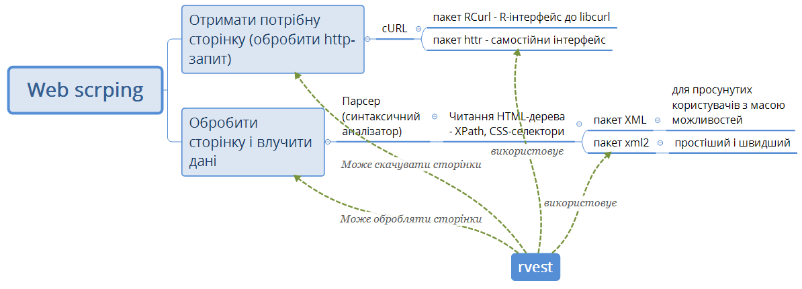

# Лабораторна робота № 9. Веб скрепінг. Пакет `rvest`. Short-версія

__Примітка.__ За основу цієї лабораторної роботи взята [робота Дмитра Храмова](http://dkhramov.dp.ua/Stu.WebMining.html#.YGSEMJ0zY2x) і його книга [@hram].


## Пакет `rvest`


Процес веб-скрепінгу складається з двох основних етапів (рис. 1):

* Отримання потрібної сторінки
* Обробки отриманої сторінки і вилучення потрібних елементів  




"Перше означає, що потрібно виконати `http` -запит за заданим `URL`. відповідно,
потрібен пакет для виконання таких запитів. Таким пакетом може бути `RCurl` [@R-RCurl] або
`httr`. Обидва засновані на `cURL`. Перший являє собою інтерфейс для використання
`libcurl` в `R`, і його буде простіше освоїти тим, хто вже знайомий з цією бібліотекою. Другий має
більш дружелюбний, але зате і більш самостійний інтерфейс" [@hram].  

`cURL` — це утиліта для організації вибірки даних з вебу, що надає можливість гнучкого формування запиту із завданням таких параметрів, як cookie, user_agent, referrer і будь-яких інших заголовків. cURL — це додаткова можливість оперувати з файлами на стороні сервера сторінок Інтернету за допомогою параметрів, що можуть бути переданими в рядку `URL`. За допомогою cURL можна, наприклад, отримати html-сторінку, не використовуючи для цього браузер [@R-RCurl].

`Libcurl` —- це бібліотека `API` для передачі, яку розробники можуть вбудувати в свої програми; `cURL` діє як автономна обгортка для бібліотеки `Libcurl`. Бібліотека `Libcurl` використовується, для забезпечення можливості передачі файлів (що адресуються за допомогою `URL`) численним додаткам (як відкритим, так і комерційним) [@R-RCurl].


"Для обробки веб-сторінок потрібен парсер -- синтаксичний аналізатор. Його
задача -- прочитати `HTML`-розмітку і перетворити її в придатну для вилучення
даних структуру. У нашому випадку такою структурою є дерево `HTML`-елементів.
А як переміщатися по цьому дереву за допомогою `XPath` і `CSS`-селекторів ми вже знаємо.
Для обробки `HTML` існують пакети `XML` [@R-XML] і `xml2` [@R-xml2]. Перший - більш зрілий і крім
читання `HTML` має масу додаткових можливостей. Другий -  легший і швидший.
Пакет `rvest` [@R-rvest] вміє одночасно і завантажувати і обробляти Веб-сторінки, викачує
він за допомогою `httr` [@R-httr], а обробляє за допомогою `xml2` [@R-xml2], благо автор у всіх трьох пакетів один - Хедлі Уікем. Розглянемо можливості цього пакета." [@hram]


## Основні методи пакета `rvest`


Методи пакета `rvest` дозволяють:  

1. Отримати `HTML/XML` розмітку і обробити її: `read_html`, `read_xml`;  
2. Визначити елемент: `html_node`, `html_nodes`;  
3. Розібрати елемент на складові частини: `html_name`, `html_attr`, `html_attrs`,  
`html_text`, `html_children`, `html_table`, `html_form`;  
4. Відправити запит через форму: `html_form`, `set_values`, `html_session`,  
`submit_form`;
5. Імітувати браузер: `jump_to`, `follow_link`, `back`, `html_session`, `session_history`;  
6. Працювати з кодуваннями: `guess_encoding`, `repair_encoding`.  
  

### Отримання `html`-сторінки і знаходження потрібного елемента

Метод  
`html_nodes (html_doc, css, xpath)`  
приймає на вхід `HTML`-документ `html_doc`, отриманий від `read_html`, і шлях до потрібного елементу, вказаний за допомогою `css`-селектор (`css`) або `XPath` (`xpath`) і повертає  список елементів, розташованих за заданим шляхом.


```{r}
# Отримати html-сторінку і знайти потрібний елемент

suppressPackageStartupMessages(library(rvest))
suppressPackageStartupMessages(library(dplyr))

html_1 <- read_html("https://uk.wikipedia.org/wiki/%D0%A1%D0%BE%D0%BD%D1%8F%D1%87%D0%BD%D0%B0_%D0%B0%D0%BA%D1%82%D0%B8%D0%B2%D0%BD%D1%96%D1%81%D1%82%D1%8C")
html <- read_html("https://uk.wikipedia.org/wiki/%D0%A1%D0%BE%D0%BD%D1%8F%D1%87%D0%BD%D0%B0_%D0%B0%D0%BA%D1%82%D0%B8%D0%B2%D0%BD%D1%96%D1%81%D1%82%D1%8C", encoding = "UTF-8")

# xpath
html_1 %>% 
  html_node(xpath='//*[@id="mw-content-text"]/div[1]/table[1]') %>% 
  html_table()

str(df)
class(df)

# css-селектор
html_1 %>% 
  html_node(css='#mw-content-text > div.mw-parser-output > table.wikitable') %>% 
  html_table()

```


Метод `html_node` приймає ті ж самі вхідні аргументи, що і `html_nodes`, але повертає  тільки перший елемент, розташований по заданому шляху.  

_Приклад._ Доступ до таблиці з певним порядковим номером.

```{r}

html_2 <- read_html("https://index.minfin.com.ua/reference/people/")

html_2 %>% 
  html_nodes('table') 

```


```{r}
html_2 %>% 
  html_nodes('table') %>% 
  .[[3]] %>% 
  html_table() %>% 
  DT::datatable()
```

### Розбір елементів на складові частини

Приклад вилучення таблиць показаний на прикладі вище за допомогою `html_table`.  
Продемонструємо вилучення інших елементів веб-сторінки.  


```{r}
html_3 <- read_html('<a href="http://google.com" rel="nofollow"> Link to the <b>Google</b></a>"')

minimal_html(html_3)

links <- html_3 %>% 
  html_nodes(xpath="//a")

links %>%
  html_name()

# Вилучення атрибутів елемента
links %>% 
  html_attrs()

links %>% 
  html_attr("href")

# Текст всередин елемента
links %>% 
  html_text()

# З видаленими пробілами
links %>% 
  html_text(trim=TRUE)

```


## Завдання на лабораторну роботу

* Виконати  завдання, видане викладачем.
* Створити звіт у вигляді .Rmd-документа у форматі RNotebook.


Див. джерела:  

1. [Описание протокола HTTP](http://web-master.pp.ru/info/04.shtml) 
1. [HTTP: The Protocol Every Web Developer Must Know - Part 1](https://code.tutsplus.com/tutorials/http-the-protocol-every-web-developer-must-know-part-1--net-31177) 
1. [HTTP Made Really Easy](https://www.jmarshall.com/easy/http/) 
1. [XPath Tutorial](http://zvon.org/xxl/XPathTutorial/Output_rus/examples.html)


